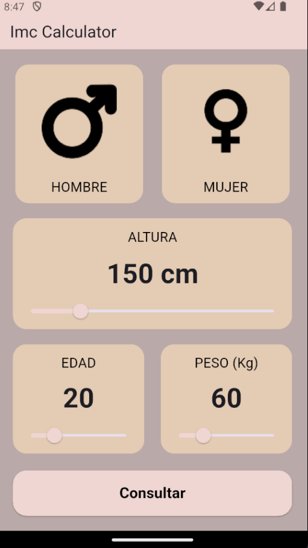
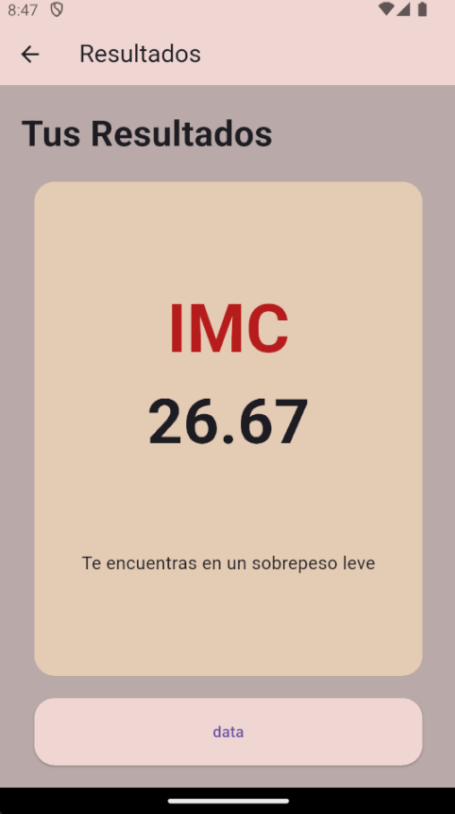

# 📱 IMC Calculator

Una aplicación simple y elegante construida con Flutter para calcular el Índice de Masa Corporal (IMC).

## ✨ Características

- **Selección de Género**: Interfaz intuitiva para seleccionar entre masculino y femenino.
- **Selector de Altura**: Deslizador fácil de usar para ajustar la altura.
- **Peso y Edad**: Controles de incremento y decremento para un ajuste preciso.
- **Cálculo Instantáneo**: Algoritmo preciso para determinar el IMC.
- **Resultados Detallados**: Clasificación del resultado (Bajo peso, Normal, Sobrepeso, etc.) con feedback visual.

## 📸 Capturas de Pantalla

|                      Inicio                      |                       Resultado                       |
| :----------------------------------------------: | :---------------------------------------------------: |
|  |  |

## 🚀 Empezando

Siga estas instrucciones para obtener una copia del proyecto y ejecutarlo en su máquina local.

### Prerrequisitos

Necesitas tener [Flutter](https://flutter.dev/docs/get-started/install) instalado en tu entorno de desarrollo.

### Instalación

1. **Clonar el repositorio**

   ```bash
   git clone https://github.com/tu-usuario/imc_calculator.git
   ```

2. **Entrar al directorio del proyecto**

   ```bash
   cd imc_calculator
   ```

3. **Instalar dependencias**

   ```bash
   flutter pub get
   ```

4. **Ejecutar la aplicación**
   ```bash
   flutter run
   ```

## 🛠️ Construido con

- [Flutter](https://flutter.dev/) - El framework de Google para crear aplicaciones hermosas.
- [Dart](https://dart.dev/) - Lenguaje de programación optimizado para clientes.

## 📄 Licencia

Este proyecto está bajo la Licencia MIT - mira el archivo [LICENSE](LICENSE) para más detalles.

---

⌨️ con ❤️ por [Tu Nombre]
